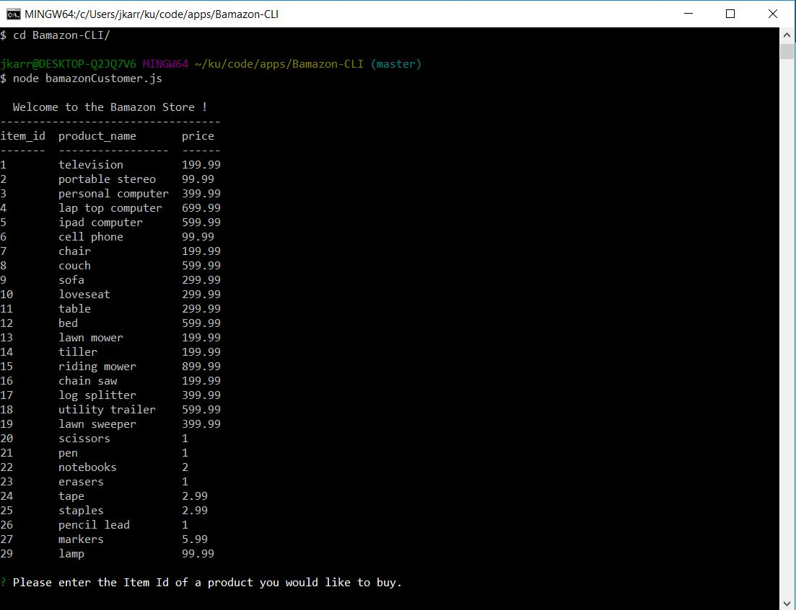
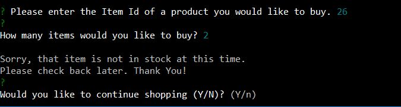
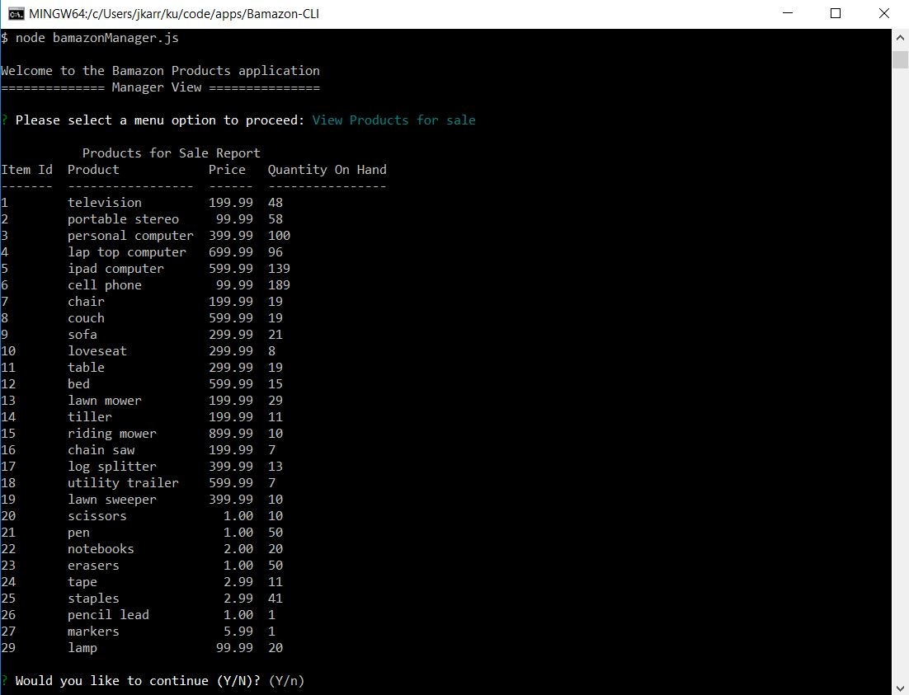
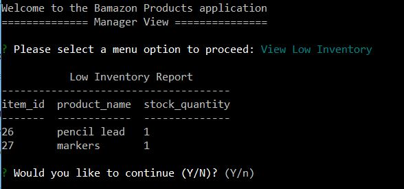
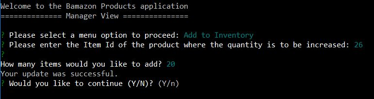
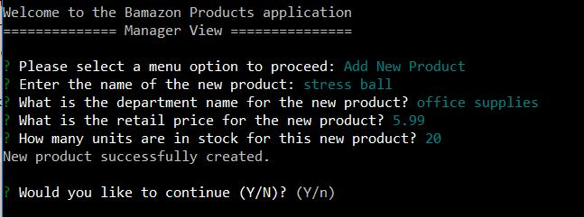
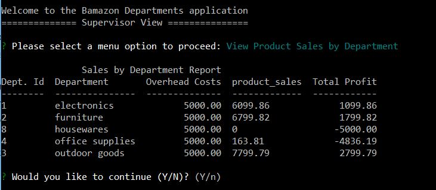
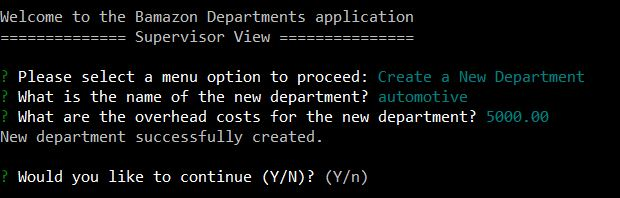

# Bamazon-CLI
This Command Line Interface (CLI) application will interact with users to process purchase requests and deplete stock from a typical e-commerce store front. 

In the "Customer View", users will be shown a list of products that are for sale. The application will prompt the user to enter the item id of the item they would like to purchase. Next, the app will ask the user how many items they would like to buy. The app will then query the mySQL database to ensure that there are enough items in stock to fulfill the purchase request. If there is sufficient stock, the app will calculate the total costs of the purchase and display that to the user. 



If there are not enough items in stock, the app will display a message to the user indicating that the item is not in stock and to please check back later. 



In the "Manager View" of the application, the user is presented with four processing options: 

1.) View Products for Sale - this option generates a "Products for Sale Report".



2.) View Low Inventory - this option generates a "Low Inventory Report".



3.) Add to Inventory - this option allows the user to add stock quantities to existing items.



4.) Add New Product - this option allows the user to enter a new product that will be offered for sale.



In the "Supervisor View", the user is presented with two processing options: 

1.) View Product Sales by Department - this option generates a report that shows the costs, total sales and total profit of each department. 



2.) Create New Department - this option allows the user to create a new department. 



Setup Instructions:
This command line interface (CLI) game uses several JavaScript npm packages to interact with the user.

To install these npm packages: Open your Command Prompt terminal and navigate to your cloned project folder. Run the 'npm install' command to add the required npm packages.

Make a .gitignore file and add the following lines to it. This will tell git not to track these files, and thus they won't be committed to Github.
```
node modules
```

This project is useful because the developer gained greater understanding and experience while working with the command line interface, mySQL databases, JavaScript component modularization designs, and using node.js npm packages.

Currently, only the original developer maintains and contributes to this project.
